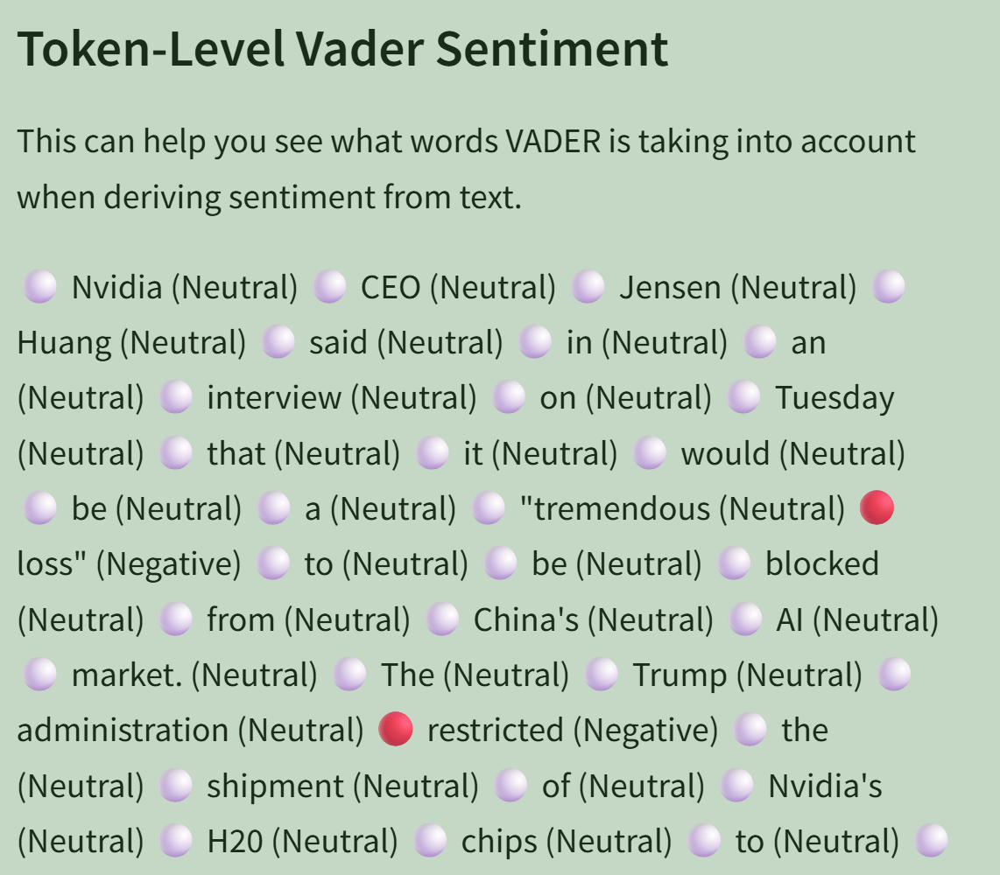

# Effect of Reddit Sentiment on Individual Stocks

## Project Overview

This Streamlit app explores how sentiment compiled from Reddit, and DJIA News(Dow Junes Industrial Average) influences individual stock performance, particularly high-profile stocks like Tesla (TSLA) and Apple (AAPL). The app uses FinBERT—a financial sentiment analysis model—to evaluate Reddit post sentiment and compares it with historical stock trends from Yahoo Finance.

"C:\Users\john\OneDrive - nd.edu\Pictures\Screenshots\Screenshot 2025-05-08 222211.png"

The goal is to uncover potential relationships between social media sentiment and market behavior, especially during volatile periods or hype-driven rallies.

---

## Setup & Run Instructions

### 1. Clone the Repository

```bash
git clone https://github.com/JRKnott/StreamlitAppFinal.git
cd StreamlitAppFinal

### 1. Setup an Environment

conda create -n streamlit_env python=3.10
conda activate streamlit_env

### 2. Install Dependencies
pip install -r requirements.txt

or manually install these libraries:

streamlit==1.31.0
pandas==2.2.2
numpy==1.26.4
matplotlib==3.8.4
plotly==5.22.0
praw==7.7.1
psaw==0.0.12
transformers==4.44.2
torch==2.4.1
vaderSentiment==3.3.2
requests==2.32.3
tokenizers==0.19.1

### 3. Set up Reddit API Credentials

.streamlit/secrets.toml
toml
Copy
Edit
[reddit]
client_id = "your_client_id"
client_secret = "your_client_secret"
user_agent = "your_user_agent"

### 4. Run APP

streamlit run "FinalProj/pages/Homepage.py" <- Insert File Path Here.


#🧩 App Features

## Homepage

Select on the right hand side, which pages you want to visit.

## Effect of Reddit Sentiment on Individual Stocks

*Warning - YFinance may not work if rate limit is reached.

Stock Selector: Choose a stock (e.g., TSLA, AAPL) to analyze.

Date Range Picker: Set custom time windows to compare sentiment and price movement.

Reddit Sentiment Analysis:

 * Fetches posts from r/Stocks, r/Investing or r/WallStreetBets. Some may have a lack of relevant data. Expand dates to see if any is available.

 * Analyzes using FinBERT to classify sentiment as Positive, Neutral, or Negative.

Stock Price Overlay:

 * Visualizes daily closing prices alongside average sentiment scores.

Downloadable Plots: Save graphs for offline analysis or presentation.

## Sentiment Analysis - Vader(Adjusted to Finbert) and S&P500 Trends

*Warning may take hours to run. (Finbert is time intensive). *I also have a version that uses Vader, I will attach in seperate document - John*
*Warning - YFinance may not work if rate limit is reached.

Uses Finbert to analyze over 51,000 rows of DJIA New Headlines.

Adjust Timeframe: Use the right hand data drop downs to choose which timeframe you want to analyze.

First Visualization: should show the daily averaged sentiment overlayed with the closing price of the S&P500

"C:\Users\john\OneDrive - nd.edu\Pictures\Screenshots\Screenshot 2025-05-03 231154.png"
* I wanted to make this visualization easier to see, but YF rate limit made troubleshooting impossible. -John


Second Visualization: Shows binned sets of sentiment data and in relation the average next 3 days closing price. This shows the correlation between sentiment and price increases. *Very Interesting

Select Headline: This drop down allows you to select certain headlines and see their overall sentiment. It is a fun way for users to interact with the tangible data they are working with.

## Vader vs. Finbert

"C:\Users\john\OneDrive - nd.edu\Pictures\Screenshots\Screenshot 2025-05-08 214529.png"

* This was a fun way of comparing the two sentiment analyzers, and was mostly for fun, however because of YFinance rates being reached, this is the only piece of code I can confirm is running on my end. Apologies for the confusion - John

This allows user to upload a pdf or input text. Note: Their is a limit to number of characters that can be read by FinBert.

Finbert side: Shows overall sentiment, Negative, Positive, Neutral, aswell as Confidence, which is expressed as a decimal from 0 to 1.

Example:

Label: Negative

Confidence: 0.54

Vader Side: This shows the overall percent of negative, netural and positive tokens. Aswell at the overall sentiment compounded as a decimal from 0 to 1, as well as an overall label, such as Positive, Neutral or Negative.

Example: 

Overall VADER Sentiment Scores:

Negative Sentiment: 6.00%

Neutral Sentiment: 84.50%

Positive Sentiment: 9.50%

Overall Sentiment (Compound): 0.7854

Overall Sentiment: Positive

"C:\Users\john\OneDrive - nd.edu\Pictures\Screenshots\Screenshot 2025-05-08 221553.png"

Takeaway: Although Finbert is much more nuanced in reading text, their are advantages to Vader, such as run time, and the unique ability to compound the different percentages into a more flexible piece of data.

References & Resources:

FinBERT Sentiment Model (https://huggingface.co/ProsusAI/finbert)

Streamlit Documentation (https://docs.streamlit.io/)

PRAW Reddit API Wrapper (https://praw.readthedocs.io/en/stable/)

Yahoo Finance Python Wrapper (https://pypi.org/project/yfinance/)

Matplotlib (https://matplotlib.org/)


